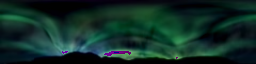

# borealis-simulation-neuralnet
PCA of Aurora Borealis images for dimensionality reduction

Upon completion: generative video output using LTSM deep learning

### What is Principal Component Analysis (PCA)?
PCA describes a dataset, often of images, using a set of common features called principal components. 
For example, in images of faces this could include distance between eyes, mouth width, ect.

In this dataset, features could express shapes of bursts of light in certain locations.
Check out this visualization: https://youtu.be/4VAkrUNLKSo?t=187

# Naive sequence generation (resulting images in GeneratedImagesRandomDistrSequence):
For each principal component, generae a random number in the uniform distribution [0,1] and map it
to the corresponding value along the trained normal distribution for that PC on the input data. 
Note the flaw in this method: images hover around 1 similar image which represents the mean weights.
This is a motivating factor to use LSTM.

At each time step, move the latent value [0,1] by a slight, randomly generated amount. This causes it to move 
slightly along the normal curve. Incorrectly colored images using a random vector of initial PCA weights instead of
a sample from the normal distrbution of that PC's weights from training.

The above examples have been color corrected for extreme color values that do not occur in
the original set and manifest themselves as outliers (i.e. bright red). 
These are the images without color correction

